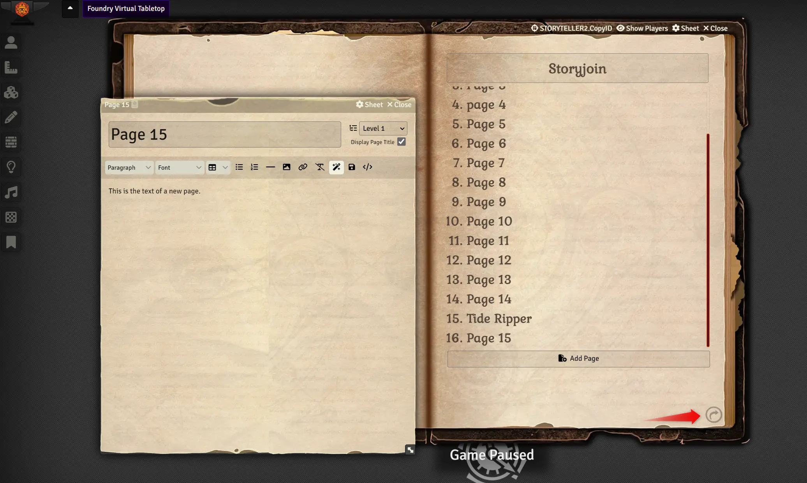
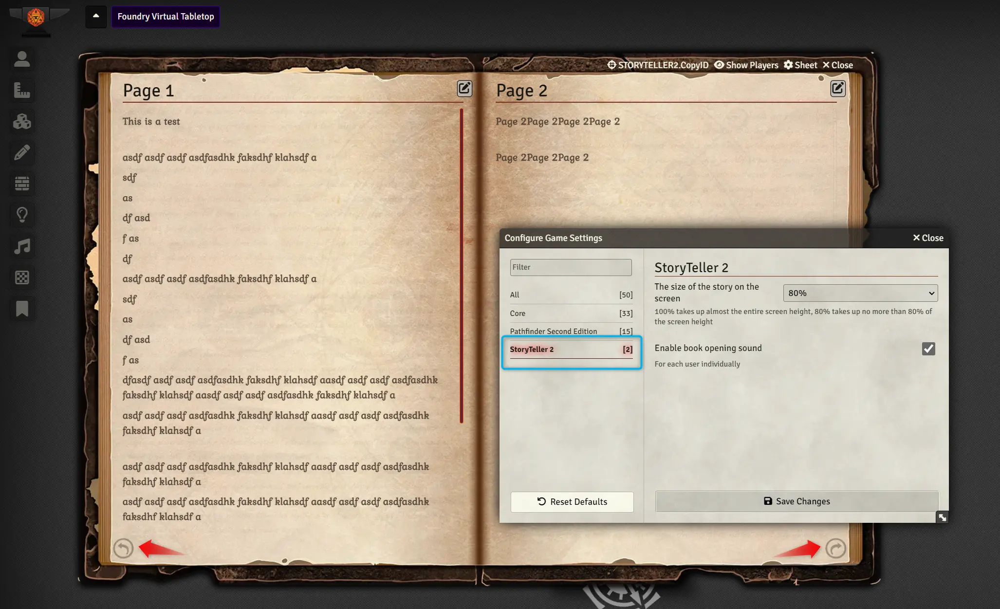

# Storyteller for Foundry VTT

A small modification that allows you to present the story in the game as an open book. Inspired by the storyteller from Pathfinder: Kingmaker

The modification allows you to use pre-prepared event descriptions, playing them out when your group gets into trouble.
When you press the "Show players" key, the story is shown to all active players.

This mod is an update to what appears to be an abandoned mod by Xbozon(https://github.com/Xbozon/storyteller). I have changed some of the functionality to fit my own needs as well as to correct a few bugs.

For best effect.

## How it looks

Each Journal Page can be selected by clicking on the page from the Table of Contents index.

Additionally, you may use the page navigation icons in the lower left or right hand corners as well as utilize the left or right arrow keys on your keyboard(editable via the core keybindings within foundry.)

There are currently 2 settings.

## Settings

There are currently two settings(both are scoped to the client NOT the world):

### 1. The size of the Story on the screen. Defaults to 80%.

### 2. Enable book opening sound.

## Bugs

Almost certainly there are some. I even know of a few and "hope" to be able to fix them.

## Additional Information

If you used the original version of this mod, you will notice that you cannot drag the pages to turn. Nor can you click the pages to turn. This is on purpose. I might be able to bring this back at some point as an option, but for now its turned off. This issue with both of these is that it made it very hard to click on the edit page icon and the original mod failed to allow use of the Table of Contents as links past four entries.

I also plan to bring single page sheets similar to Storyteller-addon-singlesheet(https://github.com/Benjaneer/storyteller-addon-singlesheet) by Benjaneer at some point in the future.

Possible ideas future ideas:

#### 1. Setting for a list of possible font styles and possibly default sizes.

#### 2. Some additional sheets. I already have a parchment page that is about half way completed.

## Technical Details

The original mod used a library named turn.js. I had to abandon that since the implementation was completely minimized javascript and it was 12 years old. I then utilized StPageFlip(https://github.com/Nodlik/StPageFlip/releases) by Nodlik, making a number of changes and incorporating bug fixes from other users plus my own(as best as I could.).
